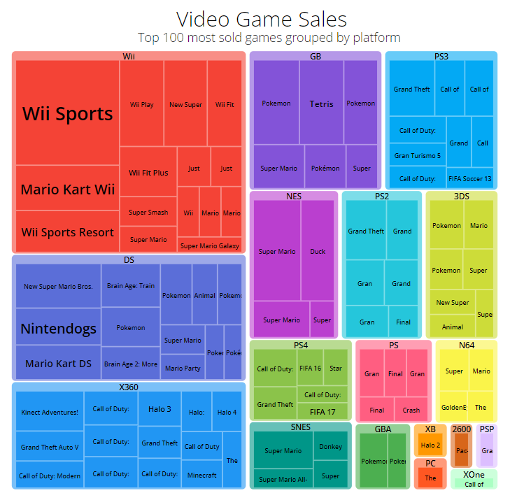
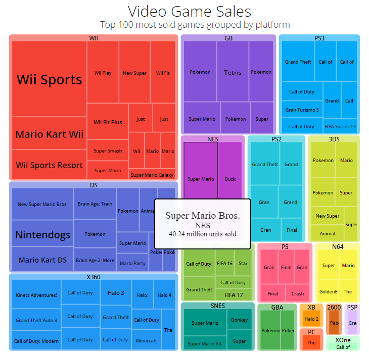

# Visualize Data with a Treemap Diagram

- This D3 graph allows you to visualize data with a treemap diagram.

Technologies used: Javascript, D3

# Live Version

# Requirements

- My tree map should have a title with a corresponding id="title".
- My tree map should have a description with a corresponding id="description".
- My tree map should have rect elements with a corresponding class="tile" that represent the data.
- There should be at least 2 different fill colors used for the tiles.
- Each tile should have the properties data-name, data-category, and data-value containing their corresponding name, category, and value.
- The area of each tile should correspond to the data-value amount: tiles with a larger data-value should have a bigger area.
- My tree map should have a legend with corresponding id="legend".
- My legend should have rect elements with a corresponding class="legend-item".
- The rect elements in the legend should use at least 2 different fill colors.
- I can mouse over an area and see a tooltip with a corresponding id="tooltip" which displays more information about the area.
- My tooltip should have a data-value property that corresponds to the data-value of the active area.